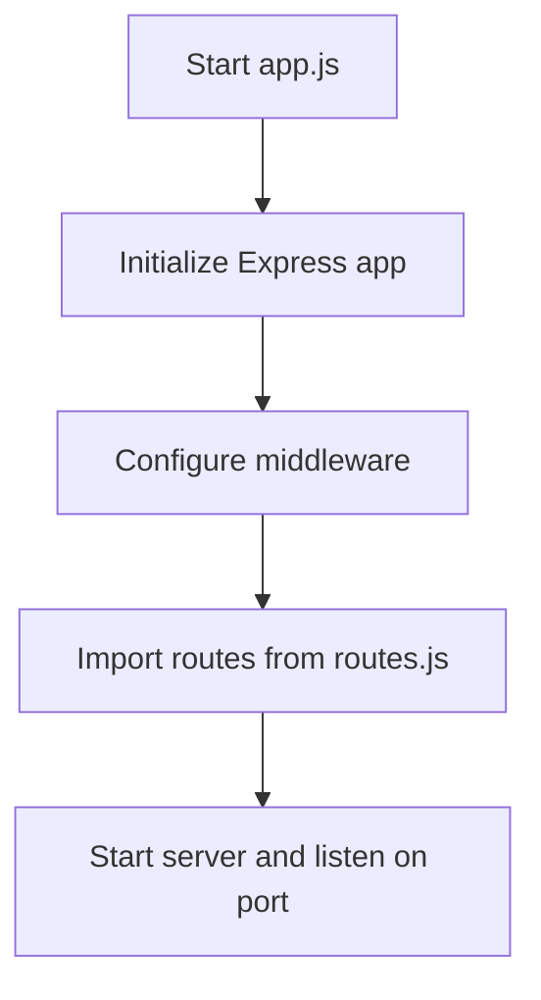

# Documentation: app.js

## Overview
The `app.js` file is the entry point for the server application. It initializes the Express application, sets up middleware, and starts the server.

## Key Responsibilities
- Initialize the Express app.
- Configure middleware (e.g., body parsers, CORS).
- Define the main routes using the `routes.js` file.
- Start the server and listen on a specified port.

## Flow Diagram

## Key Functions
- `app.use()`: Used to configure middleware.
- `app.listen()`: Starts the server and listens for incoming requests.

See the implementation in `server/app.js` for details.