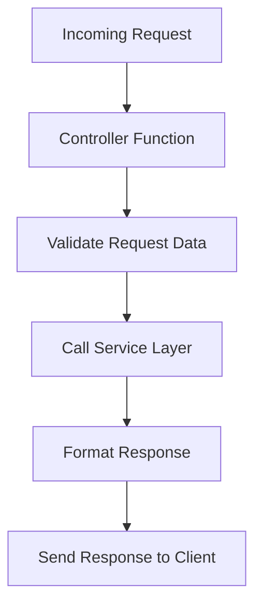

# Documentation: controller.js

## Overview
The `controller.js` file contains the logic for handling incoming requests and generating appropriate responses. It acts as the intermediary between the routes and the service layer.

## Key Responsibilities
- Validate incoming request data.
- Call the appropriate service functions.
- Format and send responses back to the client.

## Flow Diagram

## Key Functions
- `handleGenerateQR(req, res)`: Handles requests to generate QR codes.
- `handleError(err, res)`: Sends error responses.

See the implementation in `server/controller.js` for details.