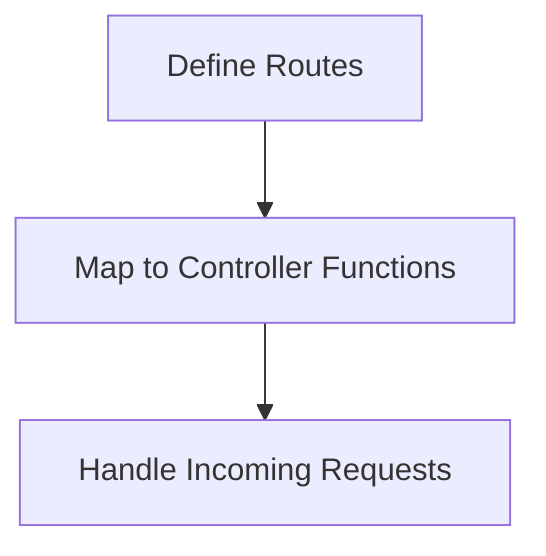

# Documentation: routes.js

## Overview
The `routes.js` file defines the API endpoints for the server. It maps HTTP methods and paths to the appropriate controller functions.

## Key Responsibilities
- Define API routes.
- Map routes to controller functions.
- Handle route-specific middleware (if any).

## Flow Diagram

## Key Routes
- `POST /generate-qr`: Maps to `controller.handleGenerateQR`.

See the implementation in `server/routes.js` for details.