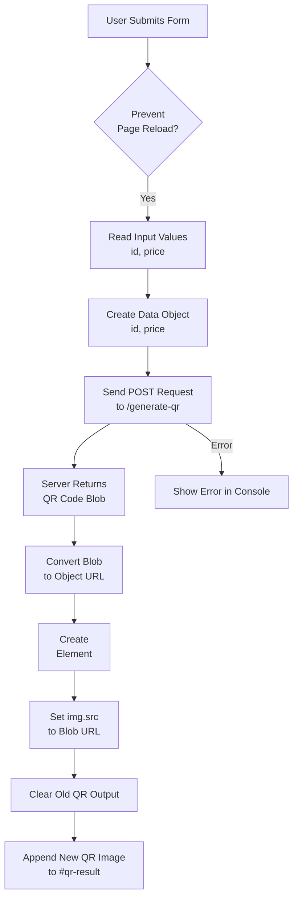

## Client script — flow and behavior

This file documents the high-level flow of the client-side script located at `client/script.js`.

Explanation (brief):
- The script prevents the default form submission, reads user inputs, and builds a JSON payload.
- It sends the payload to the server endpoint (`/generate-qr`) and expects an image or binary blob in response.
- When the response arrives the script converts it (if necessary) into an object URL and sets it as the `src` of an `img` element inside `#qr-result`.
- Errors are logged to the console and can be presented to the user.

See `client/script.js` for the concrete implementation.
