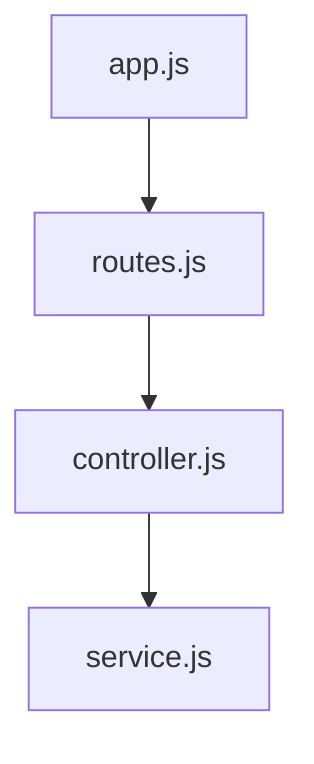
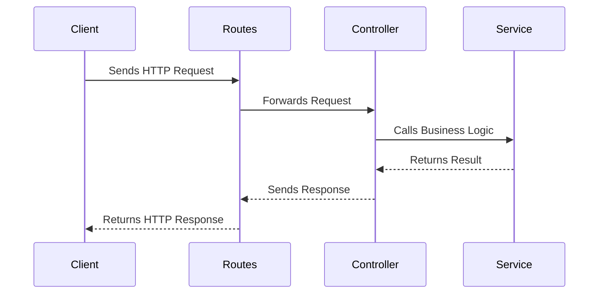

# Documentation: Server Overview

## Overview
This document explains how the files in the `server` directory are connected and their purposes. The `server` directory contains the core backend logic for the application, including routing, controllers, and services.

## File Connections
The following diagram illustrates the relationships between the files in the `server` directory:

## File Purposes

### `app.js`
- **Purpose**: Entry point for the server application.
- **Responsibilities**:
  - Initializes the Express app.
  - Configures middleware (e.g., body parsers, CORS).
  - Imports and uses the routes defined in `routes.js`.
  - Starts the server and listens on a specified port.

### `routes.js`
- **Purpose**: Defines the API endpoints for the server.
- **Responsibilities**:
  - Maps HTTP methods and paths to the appropriate controller functions.
  - Serves as the central routing file for the application.

### `controller.js`
- **Purpose**: Handles incoming requests and generates appropriate responses.
- **Responsibilities**:
  - Validates incoming request data.
  - Calls the appropriate service functions.
  - Formats and sends responses back to the client.

### `service.js`
- **Purpose**: Contains the business logic for the application.
- **Responsibilities**:
  - Implements the core operations required to fulfill requests.
  - Interacts with external libraries or APIs (if needed).
  - Returns results to the controller layer.

## Summary
- The `app.js` file initializes the server and connects the routes.
- The `routes.js` file defines the API endpoints and maps them to controller functions.
- The `controller.js` file processes requests, calls the service layer, and sends responses.
- The `service.js` file contains the business logic and performs the core operations.

Together, these files form the backend architecture of the application, ensuring a clear separation of concerns and maintainable code.

## Architecture and Data Flow

The server follows a layered architecture to ensure separation of concerns and maintainability. The data flow between the layers is as follows:

### Explanation
1. **Client**: Sends an HTTP request to the server (e.g., `POST /generate-qr`).
2. **Routes**: Maps the request to the appropriate controller function.
3. **Controller**: Validates the request, calls the service layer, and formats the response.
4. **Service**: Implements the business logic and returns the result to the controller.
5. **Response**: The controller sends the formatted response back to the client via the routes layer.

This architecture ensures that each layer has a single responsibility, making the codebase easier to maintain and extend.