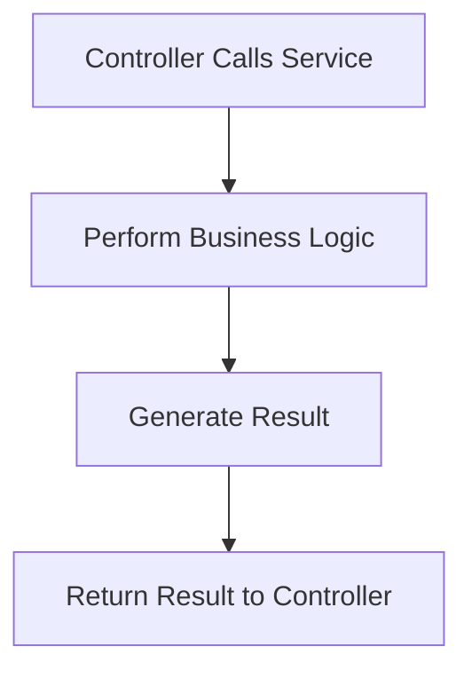

# Documentation: service.js

## Overview
The `service.js` file contains the business logic for the application. It performs the core operations required to fulfill requests, such as generating QR codes.

## Key Responsibilities
- Implement the business logic.
- Interact with external libraries or APIs (if needed).
- Return results to the controller layer.

## Flow Diagram

## Key Functions
- `generateQRCode(data)`: Generates a QR code based on the provided data.

See the implementation in `server/service.js` for details.